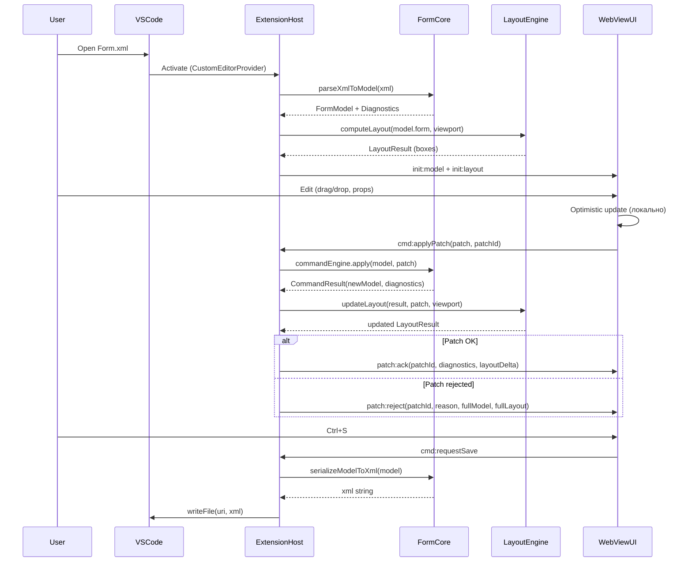

# ТЗ: Дизайнер управляемых форм 1С для VS Code
## Версия v1.1 (Production Architecture)
**Дата:** Февраль 2026
**Статус:** Production-ready specification

**Changelog v1.1:** На базе v0.3 добавлены: Layout Engine (ADR-001) как отдельный компонент Core с формальным контрактом LayoutEngine/LayoutBox; Command Engine (immutable patches + coalescing); формальная JSON Schema FormModel v1.0 (синхронизирована с TS-интерфейсами); рекомендация автогенерации Schema через CI. Единая сквозная нумерация. Все разделы v0.3 сохранены и дополнены.

---

# 1. Введение

## 1.1 Назначение
Документ определяет требования к продукту **«Дизайнер управляемых форм 1С»** (далее — *Form Designer*), реализуемому как расширение Visual Studio Code.

## 1.2 Цели v0.1
- Обеспечить **визуальное редактирование управляемых форм (УФ)**, представленных в **XML** (формат выгрузки EDT/конфигуратора).
- Реализовать архитектуру **Core Library + VS Code Extension + WebView UI**.
- Обеспечить **round-trip**: изменения в UI корректно сериализуются обратно в XML, при этом незнакомые/неиспользуемые части XML не теряются.
- Заложить основу для дальнейшего расширения (команды, события, метаданные, preview/diff, интеграции).
- **Обеспечить совместимость** с реальным форматом XML управляемых форм, который генерирует платформа 1С:Предприятие 8.3 и 1C:EDT.

## 1.3 Вне области v0.1 (явно)
- Обычные формы (ОФ) и любые двоичные форматы ОФ.
- Запуск формы в рантайме 1С, "live preview" через 1С-клиент.
- Полная валидация семантики конфигурации 1С (пока только структурная/частичная).
- Генерация обработчиков на BSL (может быть в будущих версиях).
- Работа с модулем формы (BSL-код) — только отображение ссылок на обработчики.

## 1.4 Конкуренты и аналоги

| Продукт | Что делает | Ограничения |
|---------|-----------|-------------|
| 1С:Конфигуратор | Нативный дизайнер форм | Закрытый, Windows-only, нет Git-интеграции |
| 1С:EDT | Дизайнер форм в Eclipse | Тяжёлый (~2GB), медленный, Java, закрытый |
| CodePilot1C-EDT | AI-ассистент в EDT | Нет визуального редактирования форм |
| BSL Language Server | Подсветка/линт BSL в VS Code | Не работает с формами |

**Наше преимущество:**
- Кроссплатформенность (VS Code: Windows, macOS, Linux)
- Лёгкость (< 25MB vs EDT ~2GB)
- Нативная интеграция с Git-воркфлоу
- Работа с XML напрямую (без запущенной 1С/EDT)
- Открытая архитектура (extensibility API в будущем)
- Возможность AI-ассистирования (интеграция с MCP, LLM)

---

# 2. Scope версии v0.1

## 2.1 Входит в v0.1 (MVP)
### Core
- Парсер XML УФ → **FormModel** (единый источник истины).
- Сериализатор FormModel → XML УФ (round-trip).
- Валидатор структуры FormModel.
- Механизм сохранения «unknown blocks» (preserve strategy).
- **Маппинг реальной XML-схемы 1С** (xmlns, элементы, атрибуты) в FormModel и обратно.
- **Tiered support** типов элементов (Tier 1 — полная, Tier 2 — базовая, Tier 3 — preserve-only).
- **Layout Engine** — детерминированное вычисление layout boxes в Core.
- **Command Engine** — immutable patch model с undo/redo и coalescing.

### UI (WebView)
- Дерево элементов (Hierarchy/Outline).
- Canvas-редактор (рендеринг готовых layout boxes, drag & drop, reorder).
- Инспектор свойств выбранного элемента.
- Undo/Redo с coalescing.
- Поиск по дереву элементов.
- Палитра элементов (Toolbox).

### VS Code Extension
- Custom Editor Provider для `Form.xml` (формат EDT-выгрузки).
- Сохранение результата обратно в файл.
- Preview изменений (text diff для XML) — MVP-уровень.
- File watcher (обнаружение внешних изменений).
- Dirty state tracking.

## 2.2 Не входит (перенос в v0.2+)
- Линейный формат выгрузки конфигуратора (только EDT-формат в v0.1).
- Автоматическое формирование типов/путей данных на базе метаданных конфигурации.
- Semantic diff формы (по модели), кроме простого текстового diff.
- Workspace indexing форм.
- Коллаборация/мультиюзер режим.
- Редактирование условного оформления формы.
- Редактирование команд формы (полноценное).
- Copy/Paste элементов между формами.
- Multi-select элементов.
- Canvas zoom (масштабирование).

## 2.3 Поддерживаемые форматы выгрузки

### MVP (v0.1):
Только **EDT-формат (иерархический)**:
```
src/Catalogs/Контрагенты/Forms/ФормаЭлемента/Ext/Form.xml
```

### v0.2+:
Дополнительно **линейный формат конфигуратора**:
```
Catalog.Контрагенты.Form.ФормаЭлемента.Form.xml
```

### Определение формата:
- По структуре каталогов (наличие `src/`, `Ext/`)
- По корневому XML-элементу и xmlns
- По имени файла и паттерну пути

---

# 3. Архитектура системы

## 3.1 Общий принцип
**FormModel** — Single Source of Truth.
UI и CLI/Extension работают поверх модели, а не поверх XML.

## 3.2 Компоненты

### 3.2.1 Form Core Library (packages/core-form)
Не зависит от VS Code API. Содержит:
- FormModel (TS интерфейсы)
- XML Parser/Serializer (с маппингом реальной XML-схемы 1С)
- Validator
- **Layout Engine** — вычисление layout boxes по FormModel + viewport
- **Command Engine** — Patch model, Undo/Redo, Coalescing
- Minimal diff helpers (для preview)

### 3.2.2 VS Code Extension (packages/vscode-extension)
- Custom Editor Provider (для Form.xml)
- File IO, File Watcher
- Команды VS Code
- WebView lifecycle + state recovery
- Настройки расширения
- Output Channel (логирование)

### 3.2.3 WebView UI (packages/webview-ui)
- React UI: Canvas + Tree + Property Inspector
- Canvas рендерит **готовые LayoutBox** (полученные от Extension), а не вычисляет layout сам
- Optimistic updates (локальное применение патчей)
- Коммуникация с Extension через типизированный протокол (delta updates)
- Стилизация через VS Code CSS Variables (интеграция с темами)

### 3.2.4 Shared Types (packages/shared)
- Типы сообщений Extension ↔ WebView
- FormModel TypeScript интерфейсы (реэкспорт из core-form)
- LayoutBox типы
- Константы, enum'ы

## 3.3 Data Flow



## 3.4 Custom Editor Provider

```ts
vscode.window.registerCustomEditorProvider(
  'formDesigner.managedForm',
  provider,
  {
    webviewOptions: { retainContextWhenHidden: true },
    supportsMultipleEditorsPerDocument: false
  }
);
```

Паттерны активации:
1. Файлы `Form.xml` внутри структуры `Ext/` (EDT layout)
2. Файлы `*.form.xml` (конвенция проекта)
3. XML-файлы с корневым элементом `<ManagedForm>`

---

# 4. FormModel (Canonical Contract)

> **FormModel TypeScript интерфейсы — ЕДИНСТВЕННЫЙ ИСТОЧНИК ИСТИНЫ.**
> JSON Schema (Приложение A) генерируется автоматически из этих интерфейсов.

## 4.1 Принципы
- Каждый элемент имеет два id: **xmlId** (оригинальный из XML, для round-trip) и **internalId** (UUID, для undo/diff/UI).
- Модель разделяет: структуру (tree), свойства (props), привязки (bindings), layout, style, события (events).
- **Модель является абстракцией над XML**, а не зеркалом XML. Маппинг XML↔Model определён в разделе 5.
- Типы элементов поддерживаются по tiered approach (раздел 4.6).
- **LayoutProps** — это INPUT-свойства (из XML). Вычисленные координаты (LayoutBox) хранятся ОТДЕЛЬНО от модели.

## 4.2 TypeScript интерфейсы (каноничные)

> Каноничный файл: `packages/core-form/src/model/form-model.ts`
> JSON Schema: `packages/core-form/schema/form-model.schema.json` (автогенерируемая)

```ts
export type FormModelVersion = "1.0";

// ═══════════════════════════════════════════
// FormModel — корневой контейнер
// ═══════════════════════════════════════════

export interface FormModel {
  version: FormModelVersion;
  meta?: FormMeta;
  form: FormRoot;

  /** Реквизиты формы (Form Attributes) — readonly в v0.1 */
  attributes?: FormAttribute[];

  /** Команды формы — readonly в v0.1 */
  commands?: FormCommand[];

  /** Unknown / vendor-specific XML fragments preserved for round-trip */
  unknownBlocks?: UnknownBlock[];
}

export interface FormMeta {
  origin?: { uri?: string; lineStart?: number; lineEnd?: number };
  formatting?: { mode: "preserve" | "canonical" };
  platformVersion?: string;
  xmlNamespaces?: Record<string, string>;
  exportFormat?: "edt" | "configurator";
}

// ═══════════════════════════════════════════
// Идентификация элементов
// ═══════════════════════════════════════════

export interface NodeIdentity {
  /** Оригинальный id из XML (числовой, сохраняется для round-trip) */
  xmlId: string;
  /** Внутренний id дизайнера (UUID, для undo/diff/UI refs) */
  internalId: string;
}

// ═══════════════════════════════════════════
// Form Root
// ═══════════════════════════════════════════

export interface FormRoot {
  id: NodeIdentity;
  name: string;
  caption?: LocalizedString;
  autoCommandBar?: AutoCommandBarNode;
  children: FormNode[];
  formProperties?: FormRootProperties;
}

export interface FormRootProperties {
  width?: number;
  height?: number;
  windowOpeningMode?: "LockOwnerWindow" | "LockWholeInterface" | "Independent";
  autoTitle?: boolean;
  autoUrl?: boolean;
  group?: GroupType;
}

// ═══════════════════════════════════════════
// Localization
// ═══════════════════════════════════════════

export interface LocalizedString {
  value: string;
  translations?: Record<string, string>;
}

// ═══════════════════════════════════════════
// FormNode — discriminated union
// ═══════════════════════════════════════════

export type FormNode =
  | UsualGroupNode
  | PagesNode
  | PageNode
  | ColumnGroupNode
  | CommandBarNode
  | AutoCommandBarNode
  | FieldNode
  | DecorationNode
  | ButtonNode
  | TableNode
  | UnknownElementNode;

// ═══════════════════════════════════════════
// BaseNode — общие свойства
// ═══════════════════════════════════════════

export interface BaseNode {
  id: NodeIdentity;
  kind: string;
  name: string;
  caption?: LocalizedString;
  visible?: boolean;
  enabled?: boolean;
  readOnly?: boolean;
  skipOnInput?: boolean;
  toolTip?: LocalizedString;

  layout?: LayoutProps;
  style?: StyleProps;
  bindings?: BindingProps;
  events?: EventBinding[];

  conditionalAppearance?: UnknownBlock;
}

// ═══════════════════════════════════════════
// Контейнеры (1:1 маппинг к FormGroup + kind)
// ═══════════════════════════════════════════

export interface UsualGroupNode extends BaseNode {
  kind: "usualGroup";
  children: FormNode[];
  group?: GroupType;
  representation?: "none" | "normalSeparation" | "strongSeparation" | "weakSeparation";
  showTitle?: boolean;
  collapsible?: boolean;
  collapsed?: boolean;
}

export interface PagesNode extends BaseNode {
  kind: "pages";
  children: PageNode[];
  pagesRepresentation?: "none" | "tabsOnTop" | "tabsOnBottom" | "tabsOnLeft" | "tabsOnRight";
}

export interface PageNode extends BaseNode {
  kind: "page";
  children: FormNode[];
  group?: GroupType;
  picture?: PictureRef;
}

export interface ColumnGroupNode extends BaseNode {
  kind: "columnGroup";
  children: FormNode[];
  group?: GroupType;
}

export interface CommandBarNode extends BaseNode {
  kind: "commandBar";
  children: (ButtonNode | AutoCommandBarNode)[];
  commandSource?: string;
}

export interface AutoCommandBarNode extends BaseNode {
  kind: "autoCommandBar";
  children: ButtonNode[];
}

// ═══════════════════════════════════════════
// Элементы
// ═══════════════════════════════════════════

export interface DecorationNode extends BaseNode {
  kind: "decoration";
  decorationType: "label" | "picture";
  picture?: PictureRef;
  hyperlink?: boolean;
}

export interface FieldNode extends BaseNode {
  kind: "field";
  fieldType: FieldType;
  dataPath?: string;
  mask?: string;
  inputHint?: string;
  multiLine?: boolean;
  choiceButton?: boolean;
  openButton?: boolean;
  clearButton?: boolean;
  format?: string;
  typeLink?: string;
}

export type FieldTypeTier1 = "input" | "checkbox" | "labelField";
export type FieldTypeTier2 = "radioButton" | "textBox" | "number" | "date"
  | "tumbler" | "spinner" | "pictureField";
export type FieldTypeTier3 = "trackBar" | "progressBar" | "htmlField"
  | "calendarField" | "chartField" | "formattedDocField" | "plannerField"
  | "periodField" | "textDocField" | "spreadsheetDocField"
  | "graphicalSchemaField" | "geoSchemaField" | "dendrogramField";
export type FieldType = FieldTypeTier1 | FieldTypeTier2 | FieldTypeTier3;

export interface ButtonNode extends BaseNode {
  kind: "button";
  commandName?: string;
  buttonType?: "default" | "hyperlink" | "usualButton" | "commandBarButton";
  defaultButton?: boolean;
  picture?: PictureRef;
  representation?: "auto" | "text" | "picture" | "textPicture";
  onlyInCommandBar?: boolean;
}

export interface TableNode extends BaseNode {
  kind: "table";
  dataPath?: string;
  columns: TableColumn[];
  commandBar?: CommandBarNode;
  searchStringLocation?: "none" | "top" | "bottom";
  rowCount?: number;
  selectionMode?: "single" | "multi";
  header?: boolean;
  footer?: boolean;
  horizontalLines?: boolean;
  verticalLines?: boolean;
  headerFixing?: "none" | "fixHeader";
}

export interface TableColumn {
  id: NodeIdentity;
  name: string;
  caption?: LocalizedString;
  dataPath?: string;
  visible?: boolean;
  readOnly?: boolean;
  width?: number;
  minWidth?: number;
  maxWidth?: number;
  autoMaxWidth?: boolean;
  cellType?: string;
  choiceButton?: boolean;
  clearButton?: boolean;
  format?: string;
  footerText?: string;
}

// ═══════════════════════════════════════════
// UnknownElementNode — Tier 3
// ═══════════════════════════════════════════

export interface UnknownElementNode extends BaseNode {
  kind: "unknown";
  originalXsiType: string;
  originalKind?: string;
  rawXml: string;
  children?: FormNode[];
}

// ═══════════════════════════════════════════
// Вспомогательные типы
// ═══════════════════════════════════════════

export type GroupType =
  | "vertical" | "horizontal" | "horizontalIfPossible"
  | "alwaysHorizontal" | "columnsLikeInList" | "indentedColumnsLikeInList";

export interface PictureRef {
  source: string;
  name?: string;
}

/** LayoutProps — INPUT свойства из XML. НЕ содержит вычисленных координат. */
export interface LayoutProps {
  width?: number;
  height?: number;
  autoMaxWidth?: boolean;
  autoMaxHeight?: boolean;
  horizontalStretch?: boolean;
  verticalStretch?: boolean;
  groupInColumn?: number;
  titleLocation?: "auto" | "left" | "top" | "bottom" | "right" | "none";
}

export interface StyleProps {
  font?: FontRef;
  textColor?: ColorRef;
  backColor?: ColorRef;
  borderColor?: ColorRef;
}

export interface FontRef {
  name?: string;
  size?: number;
  bold?: boolean;
  italic?: boolean;
  underline?: boolean;
  strikeout?: boolean;
}

export interface ColorRef {
  styleName?: string;
  red?: number;
  green?: number;
  blue?: number;
}

export interface BindingProps {
  dataSource?: string;
  dataPath?: string;
}

export interface EventBinding {
  event: string;
  handler?: string;
}

// ═══════════════════════════════════════════
// Реквизиты формы — readonly в v0.1
// ═══════════════════════════════════════════

export interface FormAttribute {
  id: NodeIdentity;
  name: string;
  valueType?: FormAttributeType;
  main?: boolean;
  savedData?: boolean;
  dataPath?: string;
  children?: FormAttribute[];
}

export interface FormAttributeType {
  types: string[];
  stringLength?: number;
  numberLength?: number;
  numberPrecision?: number;
  dateFractions?: "date" | "time" | "dateTime";
}

// ═══════════════════════════════════════════
// Команды формы — readonly в v0.1
// ═══════════════════════════════════════════

export interface FormCommand {
  id: NodeIdentity;
  name: string;
  title?: LocalizedString;
  action: string;
  picture?: PictureRef;
  toolTip?: LocalizedString;
  use?: "auto" | "always" | "never";
  representation?: string;
  modifiesStoredData?: boolean;
  shortcut?: string;
}

// ═══════════════════════════════════════════
// Unknown Blocks — round-trip safety
// ═══════════════════════════════════════════

export interface UnknownBlock {
  key: string;
  xml: string;
  position?: number;
}
```

## 4.3 Инварианты модели (Validator)
- `id.xmlId` уникален в рамках формы.
- `name` уникален среди siblings (в рамках одного контейнера).
- `TableNode.columns[].name` уникален в рамках таблицы.
- Ссылки `dataPath` (если заданы) — не пустые строки.
- Если `visible=false`, элемент остаётся в дереве (не удаляется).
- `events[].handler` — если задан, валидный идентификатор BSL.
- Тип `kind` — одно из допустимых значений FormNode union.
- Вложенность: `PageNode` — только внутри `PagesNode`; `TableColumn` — только внутри `TableNode`.

## 4.4 Стратегия id

### При импорте из XML:
- `xmlId` = оригинальный id из XML (как есть, обычно числовой)
- `internalId` = UUID v4 (генерируется при парсинге)
- При повторном открытии: `internalId` генерируется заново
- При сериализации: используется `xmlId`

### Для новых элементов:
- `xmlId` = `String(maxXmlId + 1)` — воспроизводим поведение 1С
- `internalId` = UUID v4

```ts
function generateNewXmlId(model: FormModel): string {
  const allIds = collectAllXmlIds(model);
  const numericIds = allIds.map(id => parseInt(id, 10)).filter(n => !isNaN(n));
  if (numericIds.length === 0) return crypto.randomUUID();
  return String(Math.max(...numericIds) + 1);
}
```

## 4.5 Поиск элементов

```ts
function findNodeByInternalId(root: FormRoot, internalId: string): FormNode | null;
function findNodeByXmlId(root: FormRoot, xmlId: string): FormNode | null;

/** Кеш для быстрого доступа. Перестраивается при структурных изменениях */
type NodeIndex = Map<string /* internalId */, FormNode>;
```

## 4.6 Tiered support типов элементов

| Tier | Поддержка | Парсинг | Дерево | Canvas | Inspector | Редактирование |
|------|----------|---------|--------|--------|-----------|----------------|
| **1** | Полная | ✅ | иконка + имя | рендер виджета | все свойства | ✅ |
| **2** | Базовая | ✅ | иконка + имя | серый виджет | общие свойства | ✅ общие |
| **3** | Preserve | raw XML | "?" + имя + тип | серый блок | readonly XML | ❌ |

**Tier 1 (полная):** UsualGroupNode, PagesNode, PageNode, ColumnGroupNode, CommandBarNode, AutoCommandBarNode, FieldNode (input, checkbox, labelField), DecorationNode (label), ButtonNode, TableNode.

**Tier 2 (базовая):** FieldNode (radioButton, textBox, number, date, tumbler, spinner, pictureField), DecorationNode (picture).

**Tier 3 (preserve):** Все остальные fieldType, любые неизвестные xsi:type → `UnknownElementNode`.

---

# 4A. Реальная XML-схема управляемых форм 1С

## 4A.0 ⚠️ ВЕРИФИКАЦИЯ ОБЯЗАТЕЛЬНА

**Все XML-примеры в этом разделе ПРЕДВАРИТЕЛЬНЫЕ.** Перед разработкой парсера (Этап 0):
1. Выгрузить в EDT ≥ 3 типовых (БП 3.0, УТ 11.5, БСП 3.1)
2. Проанализировать ≥ 20 Form.xml
3. Задокументировать все xsi:type, форматы id, варианты `<title>`, различия платформ
4. Зафиксировать в `/corpus/analysis/xml-format-report.md`

## 4A.1 Расположение в EDT-проекте

```
src/Catalogs/Контрагенты/Forms/ФормаЭлемента/Ext/Form.xml
src/Catalogs/Контрагенты/Forms/ФормаЭлемента/Ext/Form/Module.bsl
```

## 4A.2 Корневая структура XML (ПРЕДВАРИТЕЛЬНАЯ)

```xml
<?xml version="1.0" encoding="UTF-8"?>
<mdclass:ManagedForm
  xmlns:xsi="http://www.w3.org/2001/XMLSchema-instance"
  xmlns:core="http://g5.1c.ru/v8/dt/mcore"
  xmlns:mdclass="http://g5.1c.ru/v8/dt/metadata/mdclass"
  uuid="a1b2c3d4-e5f6-7890-abcd-ef1234567890">
  <producedTypes>...</producedTypes>
  <n>ФормаЭлемента</n>
  <usePurposes>PersonalComputer</usePurposes>
  <attributes>...</attributes>
  <elements>...</elements>
  <commands>...</commands>
  <parameters>...</parameters>
  <commandInterface>...</commandInterface>
</mdclass:ManagedForm>
```

## 4A.3 Примеры XML-элементов (ПРЕДВАРИТЕЛЬНЫЕ)

### Группа
```xml
<elements xsi:type="FormGroup" id="42" name="ГруппаОсновная">
  <kind>UsualGroup</kind>
  <group>Vertical</group>
  <representation>NormalSeparation</representation>
  <showTitle>true</showTitle>
  <title><key>ru</key><value>Основная информация</value></title>
  <elements>...</elements>
</elements>
```

### Поле
```xml
<elements xsi:type="FormField" id="53" name="Наименование">
  <kind>InputField</kind>
  <dataPath>Объект.Наименование</dataPath>
  <handlers><event>OnChange</event><n>НаименованиеПриИзменении</n></handlers>
</elements>
```

### Декорация / Кнопка / Таблица
```xml
<elements xsi:type="FormDecoration" id="67" name="НадписьИнфо">
  <kind>Label</kind>
  <title><key>ru</key><value>Заполните обязательные поля</value></title>
</elements>

<elements xsi:type="FormButton" id="81" name="КнопкаЗаписать">
  <commandName>Form.Command.Записать</commandName>
  <defaultButton>true</defaultButton>
</elements>

<elements xsi:type="FormTable" id="90" name="ТаблицаТовары">
  <dataPath>Объект.Товары</dataPath>
  <elements xsi:type="FormField" id="91" name="ТоварыНоменклатура">
    <kind>InputField</kind>
    <dataPath>Объект.Товары.Номенклатура</dataPath>
  </elements>
</elements>
```

## 4A.4 Пространства имён

| Prefix | URI |
|--------|-----|
| mdclass | `http://g5.1c.ru/v8/dt/metadata/mdclass` |
| core | `http://g5.1c.ru/v8/dt/mcore` |
| xsi | `http://www.w3.org/2001/XMLSchema-instance` |
| form | `http://g5.1c.ru/v8/dt/form` (некоторые версии) |

## 4A.5 Маппинг xsi:type → kind

| xsi:type | XML `<kind>` | FormNode kind | Tier |
|----------|-------------|---------------|------|
| FormGroup | UsualGroup | usualGroup | 1 |
| FormGroup | Pages | pages | 1 |
| FormGroup | Page | page | 1 |
| FormGroup | ColumnGroup | columnGroup | 1 |
| FormGroup | CommandBar | commandBar | 1 |
| FormGroup | AutoCommandBar | autoCommandBar | 1 |
| FormField | InputField | field (input) | 1 |
| FormField | CheckBoxField | field (checkbox) | 1 |
| FormField | LabelField | field (labelField) | 1 |
| FormField | RadioButtonField | field (radioButton) | 2 |
| FormField | TextBoxField | field (textBox) | 2 |
| FormDecoration | Label | decoration (label) | 1 |
| FormDecoration | Picture | decoration (picture) | 2 |
| FormButton | — | button | 1 |
| FormTable | — | table | 1 |
| *всё остальное* | — | unknown | 3 |

---

# 5. Парсер/сериализатор XML (Round-trip)

## 5.1 Требования
- Парсер: tolerant mode (диагностика, не crash).
- Сериализатор сохраняет: unknownBlocks, порядок узлов (preserve mode), xmlns, xml declaration, XML-комментарии.

## 5.2 Preserve strategy

| Категория | Хранение | Round-trip |
|-----------|---------|-----------|
| Неизвестные XML верхнего уровня | `FormModel.unknownBlocks[]` | Вставляются по `position` |
| Неизвестные элементы формы | `UnknownElementNode.rawXml` | Без изменений |
| Неизвестные свойства известных элементов | `unknownBlocks[]` с привязкой по xpath key | Вставляются внутрь родителя |

## 5.3 Маппинг XML → FormModel

```ts
export const XML_TO_MODEL_KIND: Record<string, Record<string, string>> = {
  'FormGroup': {
    'UsualGroup': 'usualGroup', 'Pages': 'pages', 'Page': 'page',
    'ColumnGroup': 'columnGroup', 'CommandBar': 'commandBar',
    'AutoCommandBar': 'autoCommandBar',
  },
  'FormField': {
    'InputField': 'field', 'CheckBoxField': 'field', 'LabelField': 'field',
    'RadioButtonField': 'field', 'TextBoxField': 'field',
  },
  'FormDecoration': { 'Label': 'decoration', 'Picture': 'decoration' },
  'FormButton': { '*': 'button' },
  'FormTable': { '*': 'table' },
};

export const MODEL_TO_XML_KIND: Record<string, { xsiType: string; xmlKind?: string }> = {
  'usualGroup': { xsiType: 'FormGroup', xmlKind: 'UsualGroup' },
  'pages': { xsiType: 'FormGroup', xmlKind: 'Pages' },
  'page': { xsiType: 'FormGroup', xmlKind: 'Page' },
  'columnGroup': { xsiType: 'FormGroup', xmlKind: 'ColumnGroup' },
  'commandBar': { xsiType: 'FormGroup', xmlKind: 'CommandBar' },
  'autoCommandBar': { xsiType: 'FormGroup', xmlKind: 'AutoCommandBar' },
  'field': { xsiType: 'FormField' },
  'decoration': { xsiType: 'FormDecoration' },
  'button': { xsiType: 'FormButton' },
  'table': { xsiType: 'FormTable' },
};
```

Парсер обрабатывает оба варианта LocalizedString: `<title><key>ru</key><value>...</value></title>` и `<title>...</title>`.

## 5.4 Библиотека XML-парсинга

**fast-xml-parser** v4+ с конфигурацией:
```ts
const parserOptions = {
  ignoreAttributes: false,
  attributeNamePrefix: '@_',
  preserveOrder: true,
  commentPropName: '#comment',
  trimValues: false,
  parseTagValue: false,
};
```

---

# 6. Layout Engine

## 6.1 Решение (ADR-001)

**Гибрид:** Layout Engine в Core (`packages/core-form/src/layout/`) вычисляет layout boxes. WebView рендерит готовые прямоугольники через DOM с абсолютным позиционированием.

**Обоснование:**
- Layout детерминирован и тестируем без UI
- Canvas — чистый рендеринг, не вычисляет размеры
- Snapshot-тесты layout без браузера
- Замена рендерера (DOM → Canvas2D) не ломает layout

## 6.2 Формальный контракт

```ts
// packages/core-form/src/layout/layout-engine.ts

export interface LayoutEngine {
  /** Полное вычисление layout */
  computeLayout(root: FormRoot, viewport: Size): LayoutResult;

  /** Инкрементальный пересчёт после патча */
  updateLayout(
    previous: LayoutResult,
    patch: FormPatch,
    root: FormRoot,
    viewport: Size
  ): LayoutResult;
}

export interface Size {
  width: number;
  height: number;
}

export interface LayoutResult {
  /** internalId → LayoutBox */
  boxes: Map<string, LayoutBox>;
  /** Общий размер content area (для скролла) */
  contentSize: Size;
  /** Время вычисления (ms) */
  computeTimeMs: number;
}

/** Вычисленная позиция элемента. НЕ хранится в FormModel. */
export interface LayoutBox {
  x: number;
  y: number;
  width: number;
  height: number;
  /** Baseline для выравнивания label + widget */
  baseline?: number;
  /** Виден ли (учёт visible + активная страница) */
  visible: boolean;
  /** Для контейнеров: направление */
  direction?: "vertical" | "horizontal";
}
```

## 6.3 Алгоритм Layout (MVP)

Итеративный top-down проход по дереву:

```
computeLayout(node, availableRect):
  box = allocateBox(node, availableRect)

  if node is container:
    direction = resolveGroupType(node.group)
    remaining = box.contentArea

    // Проход 1: фиксированные размеры
    for child where child.visible:
      if child.layout.width/height defined:
        reserve fixed space, reduce remaining

    // Проход 2: stretch-элементы делят остаток
    stretchChildren = children.filter(stretch flag)
    share = remaining / stretchChildren.length

    // Проход 3: рекурсия
    offset = 0
    for child where child.visible:
      childRect = { origin: offset, size: fixed || share }
      computeLayout(child, childRect)
      offset += childRect.size[direction]

  return box
```

## 6.4 Layout-правила для типов контейнеров 1С

| Тип | Правило |
|-----|--------|
| UsualGroup (vertical) | Дети сверху вниз, stretch-элементы делят высоту |
| UsualGroup (horizontal) | Дети слева направо, stretch-элементы делят ширину |
| UsualGroup (horizontalIfPossible) | Горизонтально если хватает ширины, иначе вертикально |
| Pages | Tab bar сверху + одна активная страница |
| Page | Как vertical group внутри Pages |
| ColumnGroup | Дети горизонтально, колонки равной ширины |
| CommandBar | Дети горизонтально, кнопки по размеру контента |
| Table | Фиксированная высота (rowCount × rowHeight), колонки по width |
| Field | Одна строка: label (по titleLocation) + widget |
| Decoration | Одна строка: текст/картинка |

## 6.5 Производительность Layout

| Размер формы | Элементов | Целевое время computeLayout |
|-------------|-----------|---------------------------|
| Simple | < 50 | < 5ms |
| Medium | 50–200 | < 20ms |
| Complex | 200–500 | < 50ms |
| Huge | 500+ | < 100ms (+ warning) |

`updateLayout` (инкрементальный): < 5ms для setProp, < 20ms для структурных изменений.

---

# 7. Command Engine (Undo/Redo)

## 7.1 Принцип

**Immutable patch model.** Модель не мутируется — каждая команда создаёт НОВУЮ модель. Forward patch + inverse patch хранятся для redo/undo.

## 7.2 Формальный контракт

```ts
// packages/core-form/src/commands/command-engine.ts

export interface CommandEngine {
  apply(model: FormModel, patch: FormPatch, label?: string): CommandResult;
  undo(model: FormModel): CommandResult | null;
  redo(model: FormModel): CommandResult | null;

  readonly canUndo: boolean;
  readonly canRedo: boolean;
  readonly undoLabel?: string;
  readonly redoLabel?: string;
  readonly stackSize: number;
}

export interface CommandResult {
  model: FormModel;
  diagnostics: Diagnostic[];
  patchId: string;
}
```

## 7.3 Patch model

```ts
export type FormPatch =
  | { op: 'addNode'; parentId: string; node: FormNode; index?: number }
  | { op: 'removeNode'; nodeId: string }
  | { op: 'moveNode'; nodeId: string; newParentId: string; index: number }
  | { op: 'setProp'; nodeId: string; propPath: string; value: unknown }
  | { op: 'batch'; patches: FormPatch[] };
```

`nodeId` в патчах — всегда `internalId`.

## 7.4 Undo Stack

```ts
interface UndoEntry {
  id: string;
  label: string;
  forward: FormPatch;
  inverse: FormPatch;
  timestamp: number;
}

interface UndoStack {
  entries: UndoEntry[];
  pointer: number;
  maxSize: number;  // default: 200
}
```

## 7.5 Coalescing (группировка)

| Ситуация | Правило |
|---------|--------|
| Набор текста | Последовательные `setProp` для одного nodeId + propPath в пределах 500ms → одна undo-запись |
| Добавление элемента | `addNode` + следующие `setProp` → одна запись "Добавить {type} «{name}»" |
| Drag & drop | `moveNode` → одна запись "Переместить «{name}»" |
| Удаление | `removeNode` → одна запись "Удалить «{name}»" (с сохранением поддерева) |

---

# 8. Протокол сообщений Extension ↔ WebView

## 8.1 Принцип
UI не пишет файл. Все операции через ExtensionHost. **Delta updates** — не пересылаем полную модель.

## 8.2 Типы сообщений

```ts
// ─── Extension → UI ───
export type ExtToUIMessage =
  | { type: 'init:model'; model: FormModel; layout: SerializedLayoutResult; diagnostics: Diagnostic[] }
  | { type: 'patch:ack'; patchId: string; diagnostics: Diagnostic[]; layoutDelta?: LayoutDelta }
  | { type: 'patch:reject'; patchId: string; reason: string; model: FormModel; layout: SerializedLayoutResult }
  | { type: 'model:reload'; model: FormModel; layout: SerializedLayoutResult; diagnostics: Diagnostic[] }
  | { type: 'diag:list'; diagnostics: Diagnostic[] }
  | { type: 'config:update'; config: DesignerConfig }
  | { type: 'state:dirty'; dirty: boolean }
  | { type: 'state:restore'; uiState: UIState }
  | { type: 'theme:changed'; kind: 'light' | 'dark' | 'high-contrast' }
  | { type: 'file:externalChange'; action: 'reload' | 'conflict' };

// ─── UI → Extension ───
export type UIToExtMessage =
  | { type: 'cmd:applyPatch'; patch: FormPatch; patchId: string; undoLabel?: string }
  | { type: 'cmd:requestSave' }
  | { type: 'cmd:requestPreviewDiff' }
  | { type: 'cmd:requestUndo' }
  | { type: 'cmd:requestRedo' }
  | { type: 'ui:ready' }
  | { type: 'ui:selectNode'; nodeInternalId: string }
  | { type: 'ui:openHandler'; handlerName: string }
  | { type: 'ui:viewportResize'; viewport: Size }
  | { type: 'ui:stateSnapshot'; uiState: UIState }
  | { type: 'ui:error'; error: string; stack?: string };

// ─── Вспомогательные ───
export interface Diagnostic {
  severity: 'error' | 'warning' | 'info';
  message: string;
  nodeInternalId?: string;
  path?: string;
}

export interface UIState {
  selectedNodeId?: string;
  expandedNodeIds: string[];
  scrollPosition: { tree: number; canvas: number };
  activeView: 'design' | 'structure' | 'source';
  panelWidths: { tree: number; inspector: number };
}

/** Сериализуемая версия LayoutResult для передачи через postMessage */
export interface SerializedLayoutResult {
  boxes: Record<string /* internalId */, LayoutBox>;
  contentSize: Size;
}

/** Инкрементальное обновление layout (только изменённые boxes) */
export interface LayoutDelta {
  updated: Record<string, LayoutBox>;
  removed: string[];
}
```

## 8.3 WebView state recovery

При пересоздании WebView:
1. UI → `ui:ready`
2. Extension → `init:model` + `state:restore`
3. UI восстанавливает выделение, скролл, раскрытые узлы

FormModel не персистится (перечитывается из файла). UIState — в `workspaceState`. Undo stack не персистится.

---

# 9. UI (WebView)

## 9.1 Структура
- Left: Tree (250px, resizable)
- Center: Canvas — рендерит LayoutBox'ы (flex-grow)
- Right: Property Inspector (300px, resizable)
- Top: Toolbar
- Bottom: Diagnostics (collapsible, 150px)

## 9.2 Базовые операции
- Добавить элемент (context menu / Toolbox / drag)
- Удалить (Delete, context menu)
- Переместить (drag & drop)
- Переименовать (F2)
- Изменить свойства
- Undo/Redo
- Поиск (Ctrl+F)
- Дублировать (Ctrl+D)

## 9.3 Горячие клавиши

| Комбинация | Действие |
|-----------|---------|
| Ctrl+Z | Undo |
| Ctrl+Y / Ctrl+Shift+Z | Redo |
| Delete | Удалить |
| F2 | Переименовать |
| Ctrl+F | Поиск |
| Ctrl+S | Сохранить |
| Ctrl+D | Дублировать |
| Arrow keys | Навигация |
| Enter | Выбрать/раскрыть |
| Escape | Снять выделение |

*XML diff: Command Palette → `Form Designer: Preview XML Diff`.*

## 9.4 Инспектор свойств

Группы (Tier 1):

| Секция | Свойства |
|--------|---------|
| Основные | name, caption, toolTip |
| Видимость | visible, enabled, readOnly, skipOnInput |
| Данные | dataPath |
| Макет | width, height, horizontalStretch, verticalStretch, titleLocation, group |
| Стиль | font, textColor, backColor, borderColor |
| Поведение | choiceButton, clearButton, openButton, multiLine, format, mask |
| События | обработчики (readonly, клик → BSL) |

## 9.5 Палитра элементов (Toolbox)

| Категория | Элементы (Tier 1) |
|----------|---------|
| Контейнеры | Группа, Страницы, Группа колонок, Командная панель |
| Поля | Поле ввода, Флажок, Поле надписи |
| Декорации | Надпись |
| Кнопки | Кнопка |
| Таблицы | Таблица |

## 9.6 Режимы

- **Design** — полный UI (дерево + canvas + inspector)
- **Structure** — только дерево + inspector (быстрее)
- **Source** — readonly XML

## 9.7 Canvas

Canvas рендерит **LayoutBox'ы**, полученные от Extension:
- Контейнеры: прямоугольники с заголовком, рамкой, индикацией direction
- Поля: label + условный виджет
- Таблицы: прямоугольник с шапкой колонок
- Tier 3: серый блок "не поддерживается"
- Drag & drop с drop indicators (зелёный/красный)

## 9.8 Автоименование новых элементов

| Kind | Шаблон | Пример |
|------|--------|--------|
| usualGroup | Группа{N} | Группа1 |
| pages | Страницы{N} | Страницы1 |
| field (input) | Поле{N} | Поле1 |
| field (checkbox) | Флажок{N} | Флажок1 |
| decoration (label) | Декорация{N} | Декорация1 |
| button | Кнопка{N} | Кнопка1 |
| table | Таблица{N} | Таблица1 |

---

# 10. Настройки

## MVP:

| Key | Default | Description |
|-----|---------|-------------|
| formDesigner.formattingMode | preserve | preserve / canonical |
| formDesigner.maxUndo | 200 | Размер стека |
| formDesigner.defaultView | design | design / structure / source |

## v0.2+:

| Key | Default |
|-----|---------|
| formDesigner.canvasZoom | 100 |
| formDesigner.treeIconStyle | 1c |
| formDesigner.previewDiffOnSave | false |
| formDesigner.backupBeforeSave | false |
| formDesigner.largeFormThreshold | 200 |

---

# 11. Degraded Mode и Edge Cases

## 11.1 Без метаданных (всегда в MVP)
- dataPath как string (без autocomplete)
- Badge "No metadata" в toolbar

## 11.2 Ошибки XML
- Diagnostics, предложить текстовый режим
- **Не перезаписывать** исходный файл при ошибке парсинга

## 11.3 File watcher

| Ситуация | Действие |
|---------|----------|
| Файл изменён, модель clean | Auto-reload, `model:reload` в UI |
| Файл изменён, модель dirty | Notification: "Перезагрузить / Сохранить свою / Показать diff" |
| Файл удалён | Warning, предложить "Сохранить как" |

## 11.4 Стратегия больших форм

| Элементов | Стратегия |
|-----------|-----------|
| < 50 | Полный рендеринг |
| 50–200 | Виртуализация дерева, lazy canvas |
| 200–500 | Structure mode по умолчанию |
| 500+ | Structure only, canvas отключён |

---

# 12. Тестирование и CI Gates

## 12.1 Corpus
≥ 20 реальных Form.xml в `/corpus/forms/`: simple, medium, complex, tables, nested, edge-cases.

## 12.2 Тесты

| Тип | Что тестируем |
|-----|-------------|
| Unit (Vitest) | Parser, Serializer, Validator, Patch Engine, Coalescing, Layout Engine, Auto-naming |
| Snapshot | `parse(serialize(parse(xml))) === parse(xml)` для corpus |
| Integration | Message protocol, Custom Editor Provider, File watcher |
| E2E | Open → edit → save → verify file |

## 12.3 CI gates

| Метрика | Порог |
|---------|-------|
| Parse success | ≥ 95% corpus |
| Round-trip (known blocks) | 100% |
| Tier 3 preserve | 100% |
| Crashes | 0 |
| Extension bundle | ≤ 1MB |
| WebView bundle (gzip) | ≤ 5MB |
| Memory (medium) | ≤ 150MB |
| Memory (complex) | ≤ 300MB |
| Time to interactive (simple) | ≤ 2s |
| Time to interactive (complex) | ≤ 5s |
| Layout compute (medium) | ≤ 20ms |
| Layout compute (complex) | ≤ 50ms |
| Unit coverage (core-form) | ≥ 80% |

---

# 13. Roadmap (15 недель)

## Этап 0 — Подготовка (3 недели)

**Неделя 1:** Repo skeleton, CI, EDT-выгрузка типовых, corpus.
**Неделя 2:** Анализ XML-формата, xml-format-report.md, FormModel TS, JSON Schema.
**Неделя 3:** Parser/Serializer prototype (Tier 1), первые round-trip тесты.

## Этап 1 — Core (4 недели)

- Parser: Tier 1 + Tier 2, Tier 3 → UnknownElementNode
- Serializer с preserve strategy
- Validator
- NodeIdentity (xmlId/internalId)
- Command Engine + Undo/Redo + Coalescing
- Layout Engine (MVP алгоритм)
- Auto-naming
- Round-trip snapshot тесты ≥ 95%
- VS Code extension skeleton + Custom Editor Provider

## Этап 2 — UI (5 недель)

- WebView (React + Vite + Zustand)
- Tree (виртуализация, контекстное меню)
- Inspector (Tier 1, inline editors)
- Canvas (рендеринг LayoutBox'ов)
- Toolbar + режимы
- Delta update protocol
- Drag & Drop
- Toolbox
- Layout integration (viewport resize → recompute)

## Этап 3 — Polish (3 недели)

- Контекстное меню, горячие клавиши
- File watcher + dirty state
- XML diff preview
- Diagnostics
- Стратегия больших форм
- WebView state recovery
- Output Channel
- E2E тесты
- README Quick Start

## Этап 4 — Backlog (v0.2+)

Multi-select, Copy/Paste, линейный формат, metadata integration, semantic diff, canvas zoom, условное оформление, команды формы, шаблоны, workspace indexing, BSL Language Server, Extensibility API.

---

# 14. Definition of Done (v0.1)

- [ ] Открытие и редактирование XML УФ в дизайнере
- [ ] Поддержка реального формата Form.xml из EDT (верифицировано по corpus)
- [ ] Tier 1 — полная, Tier 2 — базовая, Tier 3 — preserve-only
- [ ] Round-trip 100% (unknown blocks не теряются)
- [ ] Undo/Redo с coalescing (≥ 200 операций)
- [ ] Layout Engine вычисляет boxes для всех Tier 1 контейнеров
- [ ] Tree + Canvas + Inspector синхронизированы
- [ ] Drag & Drop в дереве
- [ ] File watcher обрабатывает внешние изменения
- [ ] Большие формы (200+) → автоматический Structure mode
- [ ] CI gates проходят
- [ ] README Quick Start
- [ ] .vsix для ручной установки

---

# 15. Структура монорепо

```
1c-form-designer/
├── packages/
│   ├── core-form/
│   │   ├── src/
│   │   │   ├── model/          ← FormModel TS
│   │   │   ├── parser/         ← XML → FormModel
│   │   │   ├── serializer/     ← FormModel → XML
│   │   │   ├── validator/
│   │   │   ├── commands/       ← Command Engine + Undo/Redo
│   │   │   ├── layout/         ← Layout Engine
│   │   │   ├── naming/         ← Автоименование
│   │   │   └── index.ts
│   │   ├── schema/             ← JSON Schema (АВТОГЕНЕРИРУЕМАЯ)
│   │   ├── __tests__/
│   │   └── package.json
│   ├── shared/
│   │   ├── src/
│   │   │   ├── messages.ts     ← Протокол
│   │   │   ├── layout-types.ts ← LayoutBox, LayoutResult, LayoutDelta
│   │   │   ├── config.ts
│   │   │   ├── ui-state.ts
│   │   │   └── index.ts
│   │   └── package.json
│   ├── webview-ui/
│   │   ├── src/
│   │   │   ├── components/ (Tree/, Canvas/, Inspector/, Toolbar/, Toolbox/, Diagnostics/, common/)
│   │   │   ├── hooks/
│   │   │   ├── store/          ← Zustand
│   │   │   ├── bridge/
│   │   │   ├── styles/
│   │   │   └── App.tsx
│   │   └── package.json
│   └── vscode-extension/
│       ├── src/
│       │   ├── extension.ts
│       │   ├── editor/         ← Custom Editor Provider
│       │   ├── commands/
│       │   ├── watcher/
│       │   ├── config/
│       │   └── logging/
│       └── package.json
├── corpus/
│   ├── forms/ (simple/, medium/, complex/, tables/, nested/, edge-cases/)
│   └── analysis/xml-format-report.md
├── docs/ (architecture.md, xml-mapping.md, layout-engine.md, contributing.md)
├── turbo.json
├── tsconfig.base.json
└── README.md
```

**Инструменты:** Turborepo, TypeScript 5.x, Vite, esbuild, Vitest, @vscode/test-electron, React 18, Zustand, fast-xml-parser v4, @vscode/codicons, ts-json-schema-generator, ESLint + Prettier.

**Зависимости:** `shared` → `core-form`, `webview-ui`, `vscode-extension`. `core-form` самодостаточен.

---

# 16. Интеграция с конструктором запросов

Оба продукта используют одинаковые: xmlns 1С, структуру монорепо, инструменты. Точки интеграции (v0.2+): shared metadata, dataPath autocomplete, cross-navigation.

---

# 17. Accessibility (MVP)

- Keyboard navigation (Tab, Arrow keys, Home, End, Enter, Space)
- ARIA-роли: `tree`, `treeitem`, `toolbar`, `grid`
- High Contrast тема: корректное отображение
- Видимый focus outline

---

# 18. Безопасность и логирование

## 18.1 WebView
- CSP: запрет inline scripts
- Sanitize XML перед рендерингом
- Никаких внешних ресурсов

## 18.2 File Safety
- Не перезаписывать при ошибке парсинга
- Validate XML output перед записью

## 18.3 Логирование
- Output Channel "1C Form Designer"
- Ошибки парсинга, Tier 3 preserves, времена операций
- Никакой внешней телеметрии

---

# 19. Extensibility API (v0.3+)

- Регистрация кастомных `kind`, рендереров, property editors
- Хуки: `onBeforeParse`, `onAfterParse`, `onBeforeSerialize`, `onBeforeSave`, `onValidate`
- `IMetadataProvider` для MCP-серверов

---

# 20. Performance Budget

| Метрика | Simple (< 50) | Medium (50–200) | Complex (200+) |
|---------|--------------|-----------------|-----------------|
| Парсинг XML | < 50ms | < 200ms | < 500ms |
| Layout compute | < 5ms | < 20ms | < 50ms |
| Рендеринг UI | < 100ms | < 300ms | < 1s |
| Apply patch | < 10ms | < 20ms | < 50ms |
| Сериализация | < 50ms | < 200ms | < 500ms |
| Память | < 50MB | < 100MB | < 300MB |
| Open form (total) | < 200ms | < 700ms | < 2s |
| WebView bundle (gzip) | < 2MB |||
| Extension bundle | < 1MB |||

---

# Приложение A: JSON Schema FormModel v1.0

> **Эта Schema АВТОГЕНЕРИРУЕТСЯ из TypeScript интерфейсов раздела 4.2.**
> Ручное редактирование запрещено. CI проверяет соответствие.

```json
// Генерация: npx ts-json-schema-generator \
//   --path packages/core-form/src/model/form-model.ts \
//   --type FormModel \
//   -o packages/core-form/schema/form-model.schema.json

// CI gate:
// diff schema/form-model.schema.json <(npx ts-json-schema-generator ...)
// Если расходится — сборка падает.
```

Полная Schema генерируется автоматически при сборке. Ниже — справочный фрагмент ключевых определений для ревью:

```json
{
  "$schema": "https://json-schema.org/draft/2020-12/schema",
  "$id": "https://1c-form-designer.local/schemas/form-model-1.0.json",
  "title": "1C Managed FormModel",
  "type": "object",
  "required": ["version", "form"],
  "additionalProperties": false,
  "properties": {
    "version": { "const": "1.0" },
    "meta": { "$ref": "#/$defs/FormMeta" },
    "form": { "$ref": "#/$defs/FormRoot" },
    "attributes": { "type": "array", "items": { "$ref": "#/$defs/FormAttribute" } },
    "commands": { "type": "array", "items": { "$ref": "#/$defs/FormCommand" } },
    "unknownBlocks": { "type": "array", "items": { "$ref": "#/$defs/UnknownBlock" } }
  },
  "$defs": {
    "NodeIdentity": {
      "type": "object",
      "required": ["xmlId", "internalId"],
      "properties": {
        "xmlId": { "type": "string" },
        "internalId": { "type": "string" }
      }
    },
    "LocalizedString": {
      "type": "object",
      "required": ["value"],
      "properties": {
        "value": { "type": "string" },
        "translations": { "type": "object", "additionalProperties": { "type": "string" } }
      }
    },
    "LayoutProps": {
      "type": "object",
      "description": "INPUT layout properties from XML. Does NOT contain computed coordinates.",
      "properties": {
        "width": { "type": "number" },
        "height": { "type": "number" },
        "autoMaxWidth": { "type": "boolean" },
        "autoMaxHeight": { "type": "boolean" },
        "horizontalStretch": { "type": "boolean" },
        "verticalStretch": { "type": "boolean" },
        "groupInColumn": { "type": "integer" },
        "titleLocation": { "enum": ["auto","left","top","bottom","right","none"] }
      }
    },
    "FormNode": {
      "discriminator": { "propertyName": "kind" },
      "oneOf": [
        { "$ref": "#/$defs/UsualGroupNode" },
        { "$ref": "#/$defs/PagesNode" },
        { "$ref": "#/$defs/PageNode" },
        { "$ref": "#/$defs/ColumnGroupNode" },
        { "$ref": "#/$defs/CommandBarNode" },
        { "$ref": "#/$defs/AutoCommandBarNode" },
        { "$ref": "#/$defs/FieldNode" },
        { "$ref": "#/$defs/DecorationNode" },
        { "$ref": "#/$defs/ButtonNode" },
        { "$ref": "#/$defs/TableNode" },
        { "$ref": "#/$defs/UnknownElementNode" }
      ]
    }
  }
}
```

*Остальные `$defs` генерируются автоматически из TS и 1:1 соответствуют интерфейсам раздела 4.2.*

---

# Приложение B: ADR-001 Layout Engine

**Статус:** Accepted
**Дата:** 2026-02-23

## Контекст
УФ 1С описывают интерфейс не как HTML, а как иерархию контейнеров со свойствами размещения. Дизайнер должен визуально отображать структуру, поддерживать drag & drop, работать на формах 200–1000 элементов, давать предсказуемый макет (не pixel-perfect).

## Рассмотренные варианты

**A) DOM/CSS layout (flex/grid):** Быстрая разработка, но сложно обеспечить детерминизм и сопоставить 1С-семантику (stretch, group, autoSize).

**B) Canvas (рисование):** Полный контроль, но сложно с accessibility, текстовым вводом.

**C) Гибрид: Layout Engine в Core + DOM-рендеринг:** Детерминированный layout, тестируемый без UI. DOM как рендерер готовых прямоугольников.

## Решение
Вариант **C**. Layout Engine в `packages/core-form/src/layout/`. WebView получает готовые LayoutBox (x, y, width, height) и отображает их через DOM с абсолютным позиционированием. Замена рендерера не ломает layout.

## Consequences
- Layout тестируем snapshot-тестами без браузера
- UI может менять рендерер без пересчёта layout
- Для v1.1+ — richer rules без изменения протокола

---

# Приложение C: Глоссарий

| Термин | Определение |
|--------|-----------|
| УФ | Управляемая форма (1С) |
| EDT | Enterprise Development Tools (IDE от 1С) |
| FormModel | Внутренняя модель данных дизайнера |
| Round-trip | XML → Model → XML без потери данных |
| LayoutBox | Вычисленные координаты элемента (output Layout Engine) |
| LayoutProps | Свойства размещения из XML (input Layout Engine) |
| Patch | Атомарная операция изменения модели |
| Coalescing | Объединение быстрых последовательных патчей |
| Corpus | Набор тестовых XML-форм |
| Tier 1/2/3 | Уровни поддержки типов элементов |
| xmlId | Оригинальный id из XML (для round-trip) |
| internalId | UUID дизайнера (для UI/undo/diff) |
| Delta update | Отправка подтверждения патча + layout delta вместо полной модели |
| Command Engine | Компонент управления undo/redo через immutable patches |

---

# Приложение D: Ссылки

- [1С:EDT Documentation](https://its.1c.ru/db/edtdoc)
- [Управляемые формы: элементы](https://v8.1c.ru/platforma/elementy-formy/)
- [VS Code Custom Editors](https://code.visualstudio.com/api/extension-guides/custom-editors)
- [VS Code WebView API](https://code.visualstudio.com/api/extension-guides/webview)
- [Turborepo](https://turbo.build/repo)
- [fast-xml-parser](https://github.com/NaturalIntelligence/fast-xml-parser)
- [Zustand](https://github.com/pmndrs/zustand)
- [Vitest](https://vitest.dev/)
- [ts-json-schema-generator](https://github.com/vega/ts-json-schema-generator)
